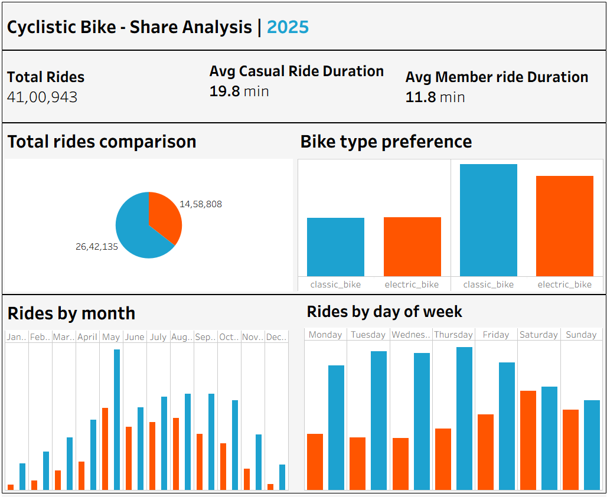

# 🚴 Cyclistic Bike-Share Analysis

> **Business Question:** How do annual members and casual riders use Cyclistic bikes differently — and how can we convert casual riders into members?

---

## 📌 Project Overview

Cyclistic is a Chicago-based bike-share company with 5,800+ bicycles and 600 docking stations. This capstone project analyzes **4.1 million bike rides** across 12 months to uncover behavioral differences between casual riders and annual members, and deliver data-driven marketing recommendations to maximize annual memberships.

This is my Google Data Analytics Professional Certificate capstone project.

---

## 🛠️ Tools Used

| Tool | Purpose |
|------|---------|
| Python (Pandas, NumPy) | Data extraction, combining 12 CSV files, preprocessing |
| SQL Server (SSMS) | Data cleaning, transformation, and analysis queries |
| Tableau Public | Interactive dashboard and data visualization |
| Excel | Initial data exploration |

---

## ❓ Business Problem

Cyclistic's finance team has concluded that **annual members are significantly more profitable** than casual riders. The marketing director believes converting casual riders (who are already familiar with the service) into annual members is the key growth lever.

To design an effective conversion campaign, we need to answer:
- How do casual riders and annual members use bikes differently?
- Why would a casual rider buy an annual membership?
- How can digital media influence casual riders to convert?

---

## 📊 Key Findings

### 🔵 Ride Duration
- Casual riders average **19.8 minutes** per ride vs members at **11.8 minutes**
- Casual riders take rides **2x longer**, suggesting leisure usage

### 📅 Day of Week Pattern
- **Members** ride consistently on **weekdays** → commuting behavior
- **Casual riders** spike on **weekends** → recreational behavior

### 🗓️ Seasonal Trends
- Both groups peak in **summer (May–August)**
- Casual ridership drops sharply in winter — conversion campaigns should launch in **April**

### 📈 Ride Volume
- Members = **64%** of total rides
- Casual riders = **36%** of total rides — a significant untapped base

---

## 💡 Recommendations

1. **Weekend Membership Tier** — Offer a lower-cost weekend-only plan to match casual rider habits and lower the barrier to committing
2. **Summer Launch Campaign** — Run targeted digital ads starting April to catch riders before peak season
3. **Location-Based Targeting** — Place ads near parks, lakefronts, and tourist cycling routes where casual riders are concentrated
4. **Ride Duration Incentive** — Reward longer rides with membership discounts to appeal to casual riders' usage patterns

---

## 📉 Dashboard

🔗 (https://public.tableau.com/views/cyclisticanalysis_17799312243350/Dashboard1)

---

## 🗃️ Data Source

- **Source:** [Divvy Bike Trip Data](https://divvy-tripdata.s3.amazonaws.com/index.html) (publicly available, provided by Motivate International Inc.)
- **Period:** 12 months of ride data
- **Size:** 4.1 million rows across 13 columns
- **License:** [Data License Agreement](https://divvybikes.com/data-license-agreement)

---

## ▶️ How to Run

1. Clone this repository
2. Download the Divvy trip data CSV files and place them in a `data/` folder
3. Run `cyclistic_analysis.py` to combine and process the data
4. Open `analysis_queries.sql` in SQL Server Management Studio for analysis queries
5. View the final dashboard on [Tableau Public](https://public.tableau.com/views/cyclisticanalysis_17799312243350/Dashboard1)

---

## 👤 About Me

I'm **Sadeep Dudekula**, a B.Tech (AIML) graduate and aspiring Data Analyst from India. This project is part of my Google Data Analytics Professional Certificate capstone, demonstrating end-to-end skills in Python, SQL, and Tableau.

🔗 [LinkedIn](https://www.linkedin.com/in/sadeep-dudekula-377911272?utm_source=share_via&utm_content=profile&utm_medium=member_android) &nbsp;|&nbsp;;

---

*This project uses publicly available data under the Divvy Data License Agreement. It does not contain personal or identifiable user information.*

